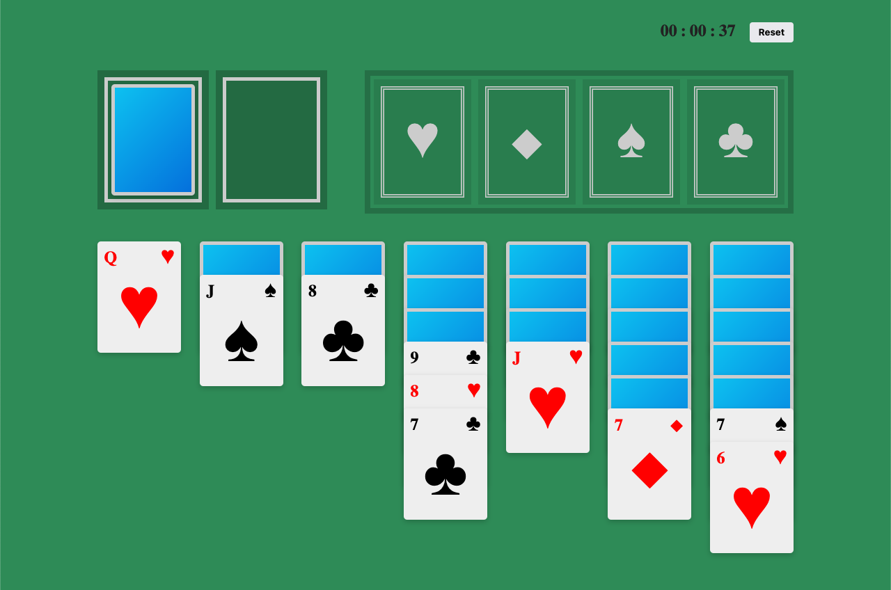

# Solitaire

Learning `react-dnd` by implementing a **solitaire** simple version



<span>Playing around with react-dnd</span>

## Getting started

You can play with it by running:

```sh
yarn & yarn dev
```

Or you can test it out inside [Code Sandbox Playground](https://codesandbox.io/s/solitaire-react-dnd-j586fg)

### Features

- Drag and Drop with react-dnd
- Game logic using context-api

## Built With

- [React](https://react.dev/)  - A JavaScript library for building user interfaces
- [react-dnd](https://react-dnd.github.io/react-dnd/about)  -  Drag and Drop for React

## Author

- **Marcio Mendes** - [mmendesas](https://github.com/mmendesas)

## License

This project is licensed under the MIT License
